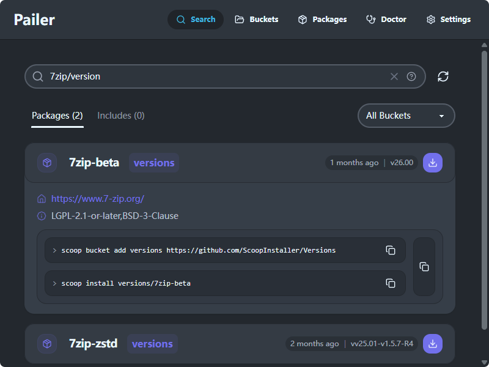

# 搜索 - 发现软件

搜索页面是您在已添加到本地的软件仓库中探索和发现软件的起点。它专注于本地搜索，帮助您快速找到并安装需要的软件。

## 核心特性

### 🎯 本地仓库搜索

搜索功能**仅针对已添加到本地的 bucket**，不会进行在线搜索。这意味着：

- 搜索结果完全来自您已安装的仓库
- 搜索速度更快，无需网络请求
- 结果更可靠，基于本地缓存的软件信息

### 📦 全面的搜索内容

搜索结果包括：

- **软件包（Package）**：完整的应用程序和工具
- **包含文件（Include）**：可复用的组件和库
- **仓库筛选**：可按特定仓库过滤搜索结果

### ⚡ 便捷的安装体验

每个搜索结果卡片都提供：

- **一键安装**：点击即可直接安装软件
- **命令行复制**：复制安装命令到剪贴板
- **快速预览**：通过徽标查看 manifest 等基本信息

### ⌨️ 快捷键支持

搜索页面支持键盘快捷操作：

- **直接输入**：无需点击，直接键入即可开始搜索，具体查看“快捷键介绍”TODOTODOTODOTODOTODOTODOTODO
- **翻页操作**：使用 ←→ 键进行结果翻页

## 常见问题

### 如何扩展搜索范围？

要获得更多搜索结果，您可以：

**添加更多仓库**：前往 [scoop.sh](https://scoop.sh/) 查找公开的 Package 和 bucket 内容

通过本地搜索，您可以快速发现和安装需要的软件，扩展系统的功能。
